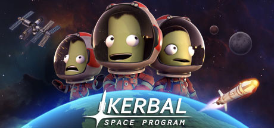

Kerbal Space Program is really fun

### Manage your own space program in KSP

1. Build rockets, space shuttles, probes, satellites, or a friggin space station.
2. Fly them to the orbit, the Moon, the other moon, or other planets. The solar system is your sandbox!
3. Do science experiments in space!
